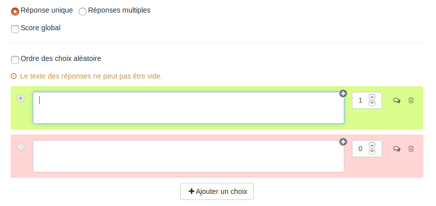
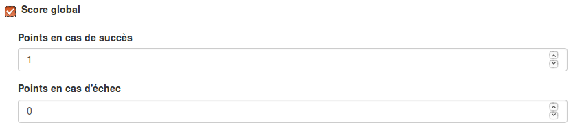
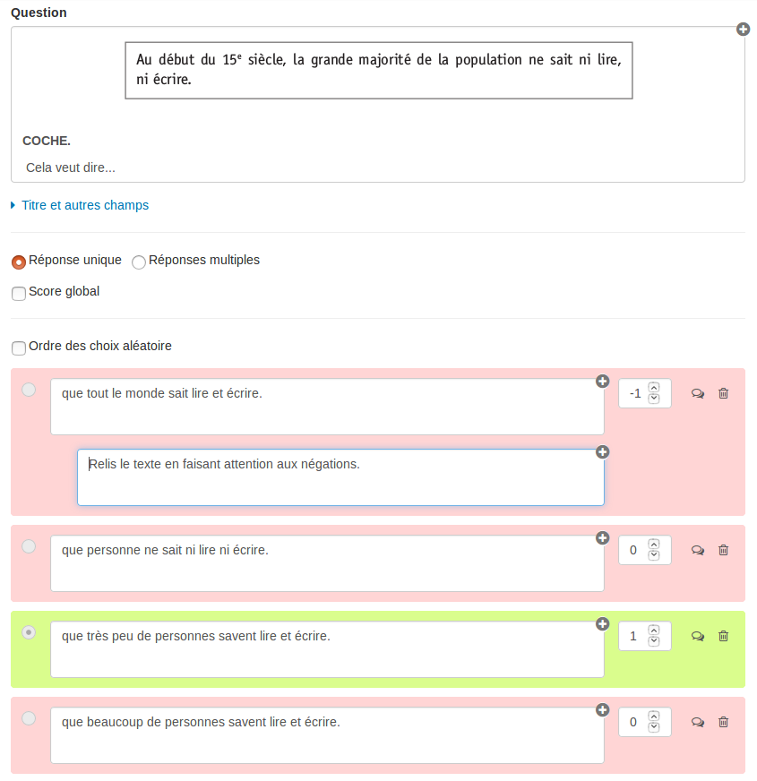
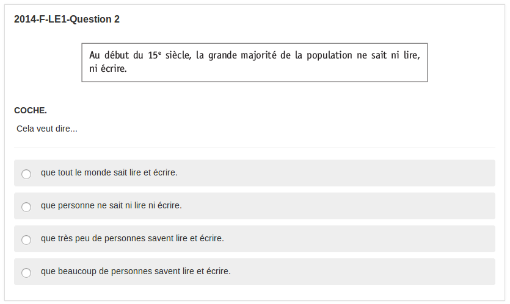
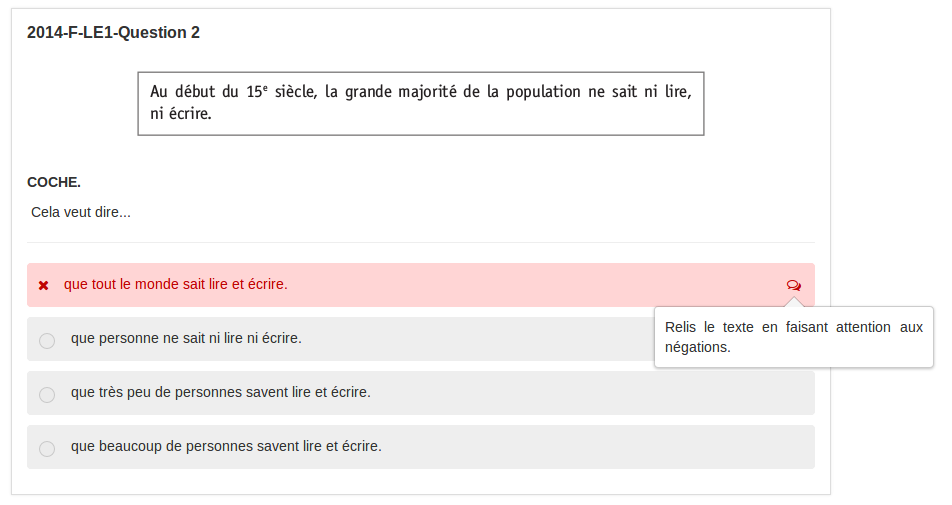
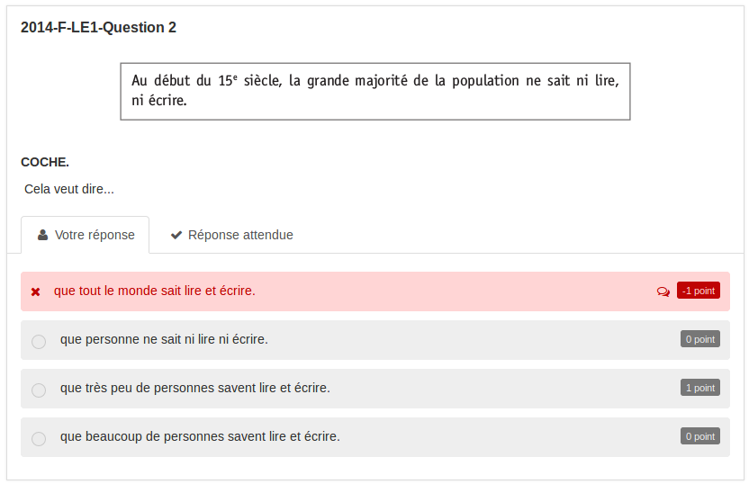
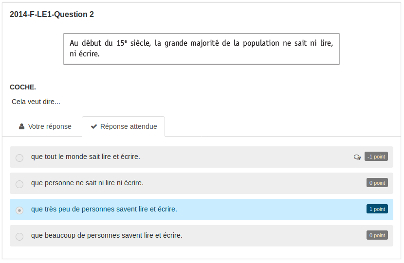

### Question Choix Multiple

---

La question à choix multiple permet de créer des questions où les utilisateurs devront choisir une ou plusieurs réponses \(texte, image, son, vidéo,...\) dans une liste de choix prédéfinis.

Lorsque vous avez rempli les champs communs à toutes les questions \(cf. [Créer une nouvelle question](create_new_question.md) \), vous devez remplir le formulaire spécifique à la question choix multiple.

#### **Réponse unique/Réponse multiple**

Si vous choisissez "réponse unique", lors de la passation, l'utilisateur ne pourra faire qu'un seul choix parmi les propositions données.  
Si vous choisissez "réponse multiple", lors de la passation, l'utilisateur pourra sélectionner plusieurs choix parmi les propositions données.

#### Score global

Par défaut, c'est-à-dire quand cette option n'est pas cochée, le score obtenu sera celui qui est associé au choix que fera l'utilisateur.

Si vous choisissez le score global, des points seront attribués seulement si tout est juste \(points en cas de succès\). S'il y a ne serait-ce qu'une erreur, ce seront les points en cas d'échec qui seront attribués \(ils peuvent être nuls ou négatifs\).

#### Ordre des choix aléatoires

En cochant cette option, vos choix seront disposés aléatoirement lors de la passation. A contrario, si vous ne la cochez pas, les choix seront affichés dans l'ordre dans lesquels vous les aurez créés.

#### **Les choix**

Les choix peuvent être du texte simple, une image, une vidéo ou encore un audio \(en utilisant l'éditeur de texte riche\). Chaque choix doit être associé à un score et au moins un choix doit avoir un score positif. Le fond de couleur permet de voir si le score associé à la réponse est positif \(vert\) ou négatif ou nul \(rouge\).

Chaque choix peut avoir un feedback. Le feedback est un message non obligatoire que vous pouvez adresser à l'utilisateur si celui-ci sélectionne ce choix. Ce feedback sera affiché en fin d'étape si cette option a été choisie dans les paramètres du questionnaire \(cf. "Afficher les feedbacks en fin d'étape" dans  [Correction](quiz_parameters_correction.md)\) ainsi que dans la correction.  
En cliquant sur l'icône  : , vous ouvrez le champ texte où vous écrirez le feedback.

Enfin, la poubelle vous permet de supprimer le choix, mais il est nécessaire d'avoir au minimum deux choix.

Voici un exemple de conception d'une question.

Au moment de répondre, l'utilisateur verra :

Feedback en fin d'étape :

Correction de la question avec la réponse de l'utilisateur :  

Et la réponse attendue :

#### 

