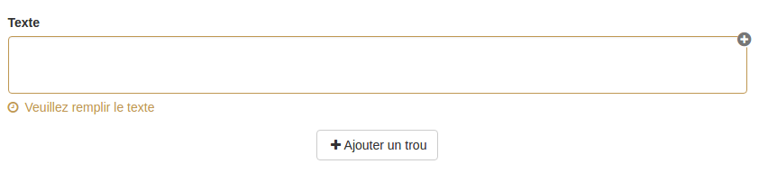

### Question texte à trous

---

La question texte à trous permet de créer des questions où les utilisateurs devront combler des lacunes avec des éléments pertinents dans le contexte. Il est possible de les compléter soit en rédigeant une zone texte soit en choisissant l'élément dans une liste prédéfinie.

Lorsque vous avez rempli les champs communs à toutes les questions \(cf. [Créer une nouvelle question](create_new_question.md) \), vous devez remplir le formulaire spécifique à la question texte à trous.

#### Texte

Le remplissage du formulaire s'organise en deux temps : vous devez écrire votre texte puis créer les trous.

Quand vous avez écrit votre texte, sélectionnez le ou les mots qui feront l'objet du trou, puis cliquez sur "ajouter un trou". En cliquant, une popover s'ouvre afin d'éditer le trou. 

Vous pourrez alors donner un score \(positif ou négatif\) et un feedback au mot que l'utilisateur devra taper. La couleur de la liaison permet de voir si le score associé à la réponse est positif \(vert\) ou négatif ou nul \(rouge\).

Vous pouvez donner plusieurs propositions de réponses voire anticiper les mauvaises.

Le feedback est un message non obligatoire que vous pouvez adresser à l'utilisateur si celui-ci crée cette liaison au moment de la passation. Ce feedback sera affiché en fin d'étape si cette option a été choisie dans les paramètres du questionnaire \(cf. "Afficher les feedbacks en fin d'étape" dans  [Correction](quiz_parameters_correction.md)\) ainsi que dans la correction.  
En cliquant sur l'icône  : , vous ouvrez le champ texte où vous écrirez le feedback.

Enfin, la poubelle vous permet de supprimer la liaison.

Pour fermer cette popover d'édition de l'association cliquez sur la croix en haut à droite.

Si vous souhaitez qu'il y ait des intrus, il vous suffit de ne pas associer un item avec un autre.

Voici un exemple de conception d'une question.

