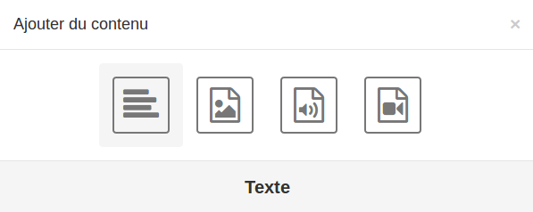
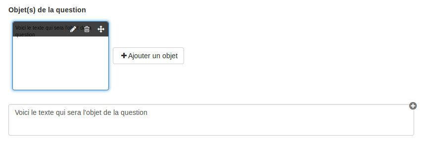
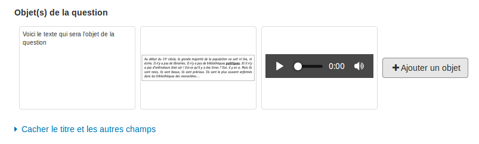
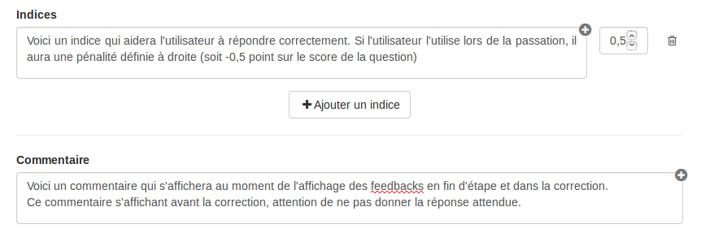

### Créer une nouvelle question

---

Pour créer une question choisissez le type de question que vous souhaitez concevoir.

Certains champs du formulaire de création d'une question sont communs à tous les types de question.

#### Question

C'est dans ce champ que vous devez mettre la consigne de votre question. Ce champ est obligatoire.

#### Titre et autres champs

_Ces champs ne sont pas obligatoires_

* **Titre**

Vous pouvez donner un nom à votre question. Il sera directement changé dans l'entête de la question et sera visible lors de la passation de l'exercice par les utilisateurs.

* **Description**

Comme pour l'étape, la description de la question sera visible lors de la passation.

* **Objet\(s\) de la question**

L'objet de la question est un élément  sur lequel porte la question. Il sera affiché en dessous de la description de l'étape.  
Après avoir cliqué sur "ajouter un objet", vous devez choisir le type d'objet que vous souhaitez ajouter : texte, image, audio ou vidéo.

Si vous choisissez le texte, un champ s'ouvre en dessous de la vignette et vous pouvez tapez votre texte.

Si vous choisissez une image, un audio ou une vidéo, une fenêtre s'ouvrira pour vous permettre d'importer un fichier depuis votre ordinateur.

#### Indices et commentaire final

_Ces champs ne sont pas obligatoires_

* **Indices**

L'indice est une aide pour l'utilisateur. Lors de la passation cet indice n'est pas affiché par défaut. Si l'utilisateur veut y avoir accès, il doit cliquer dessus. Si c'est le cas, il pourra avoir une pénalité si vous l'avez prédéfinie dans le champ numéraire à droite du champ texte.

Voici comment se présente l'indice lors de la passation : 

* **Commentaire final**

Le commentaire final s'affiche lors de la passation au moment de l'affichage des feedbacks en fin d'étape ainsi que dans la correction.  
Ce commentaire s'affichant avant la correction, attention de ne pas donner la réponse attendue.

