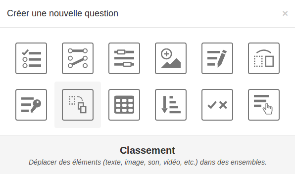
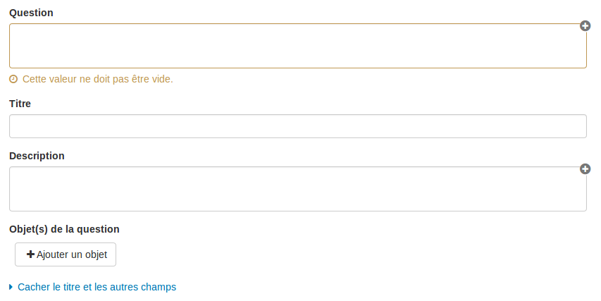

#### Créer une nouvelle question

---

Pour créer une question choisissez le type de question que vous souhaitez concevoir.

Certains champs du formulaire de création d'une question sont communs à tous les types de question.

##### Question

C'est dans ce champ que vous devez mettre la consigne de votre question. Ce champ est obligatoire.

##### Titre et autres champs
*Ces champs ne sont pas obligatoires*

* Titre

* Description

* Objet(s) de la question

##### Indices et commentaire final
*Ces champs ne sont pas obligatoires*

* Indices

* Commentaire final
