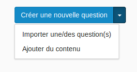

### Créer/importer une question ou ajouter du contenu

---

Une fois dans l'étape, vous pouvez choisir entre  3 options :

* créer une question,
* importer une question depuis votre banque de questions,
* ajouter du contenu.

