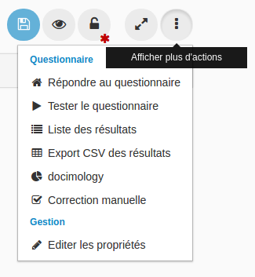

### Répondre au questionnaire

---

Dans le menu des actions supplémentaires possibles du questionnaire, vous pouvez accéder à différentes pages en fonction de vos droits :

En cliquant sur "répondre au questionnaire" vous êtes dirigé vers le début du questionnaire. 

Répondre au questionnaire engendrera une copie et aura donc une incidence sur :

* [la liste des résultats](result_list.md),
* la docimologie, 
* les résultats que vous pouvez exporter en csv.

