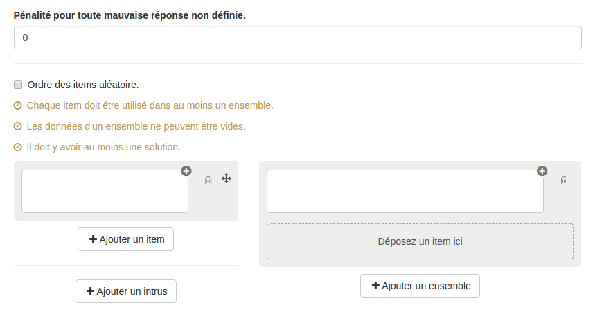

### Question Classement

---

La question classement permet de créer des questions où les utilisateurs devront mettre des éléments dans un ou plusieurs ensembles. Ces éléments peuvent être du texte, une image, du son ou une vidéo.

Lorsque vous avez rempli les champs communs à toutes les questions \(cf. [Créer une nouvelle question](create_new_question.md) \), vous devez remplir le formulaire spécifique à la question association.

#### Pénalité pour toute mauvaise réponse non définie

Vous pouvez définir dans ce champ une pénalité pour toute erreur effectuée par l'utilisateur lors de la passation. Cette pénalité exprimée en points positifs, par exemple 1 point de pénalité équivaudra a un retrait de 1 point du score total de la question pour chaque réponse erronée. Cela peut donc engendrer des scores négatifs.

Cette pénalité ne se cumule pas à des réponses erronées que le concepteur aurait déjà défini \(association avec un score négatif\).

#### Ordre des items aléatoires

En cochant cette option, vos items seront disposés aléatoirement lors de la passation. A contrario, si vous ne la cochez pas, les items de la colonne de gauche et de droite seront affichés dans l'ordre dans lesquels vous les aurez créés.

#### Les items et les ensembles

Le remplissage du formulaire s'organise en deux temps : vous devez créer vos items et vos ensembles puis déplacer les items dans les ensembles tel que devra le faire l'apprenant. Autrement dit, vous créez d'abord la question telle que la verra l'utilisateur, puis vous donnez les réponses en déplaçant les items comme le fera l'utilisateur lors de la passation

* **Création des items et des ensembles**

Les items \(colonne de gauche\) et les ensembles \(colonne de droite\) peuvent être du texte simple, une image, une vidéo ou encore un audio \(en utilisant l'éditeur de texte riche\).

Si vous souhaitez rajouter de la complexité, vous pouvez ajouter un intrus en cliquant sur "ajouter un intrus". Cet intrus est associé à un score \(nul ou négatif\) et peut aussi avoir un feedback.

Le feedback est un message non obligatoire que vous pouvez adresser à l'utilisateur si celui-ci déplace l'intrus dans un ensemble au moment de la passation. Ce feedback sera affiché en fin d'étape si cette option a été choisie dans les paramètres du questionnaire \(cf. "Afficher les feedbacks en fin d'étape" dans  [Correction](quiz_parameters_correction.md)\) ainsi que dans la correction.  
En cliquant sur l'icône  : , vous ouvrez le champ texte où vous écrirez le feedback.

Le score sera comptabilisé seulement si l'utilisateur a déplacé cet intrus dans un ensemble.

La poubelle vous permet de supprimer l'intrus.

* **Déplacer les items dans les ensembles**

Une fois les items et les ensembles créés, vous pouvez classer les items dans les ensembles.

Pour cela vous devez déplacer un item dans la zone de l'ensemble prévue à cet effet. Chaque item déplacé dans un ensemble est associé à un score et un feedback \(facultatif\). Vous pouvez lui associer un score positif, nul ou négatif.

