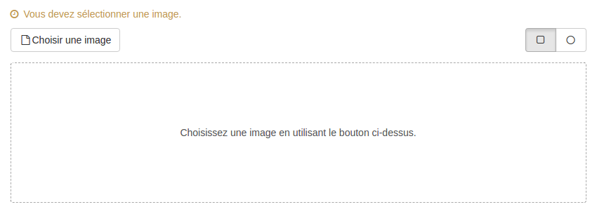

### Question Graphique

---

La question graphique permet de créer des questions où les utilisateurs devront positionner un ou plusieurs pointeurs sur une image.

  
Lorsque vous avez rempli les champs communs à toutes les questions \(cf. [Créer une nouvelle question](create_new_question.md) \), vous devez remplir le formulaire spécifique à la question graphique.

#### L'image

Dans un premier temps vous devez choisir l'image où vous placerez les zones de réponse. Vous pouvez importer une image de votre ordinateur en cliquant sur "Choisir une image".

Vous pouvez choisir en haut à droite si vous souhaitez créer des zones de réponses circulaire ou rectangulaire.

un fois le style de zone choisi, pour créer une zone, il vous suffit de cliquer une fois sur l'endroit de l'image où vous souhaitez positionner la zone de réponse. Cette zone est associée à un bouton d'édition et un bouton poubelle qui vous permet de supprimer la zone.

En cliquant sur le crayon, vous avez accès aux paramètres de la zone.
Vous pourrez alors donner une couleur, un score \(positif ou négatif\) et un feedback à la zone. 

Le feedback est un message non obligatoire que vous pouvez adresser à l'utilisateur si celui-ci crée cette liaison au moment de la passation. Ce feedback sera affiché en fin d'étape si cette option a été choisie dans les paramètres du questionnaire \(cf. "Afficher les feedbacks en fin d'étape" dans  [Correction](quiz_parameters_correction.md)\) ainsi que dans la correction.  
En cliquant sur l'icône  : , vous ouvrez le champ texte où vous écrirez le feedback.

Ces paramètres seront visibles et comptabilisés si l'utilisateur positionne un pointeur dans cette zone lors de la passation.

Pour fermer cette popover d'édition de l'association cliquez sur la croix en haut à droite.

