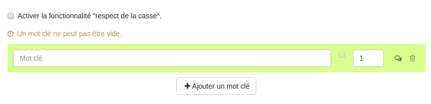

### Question Mots clés

---

La question mots clés permet de créer des questions où les utilisateurs devront rédiger une réponse avec un ou plusieurs mots clés attendus

Lorsque vous avez rempli les champs communs à toutes les questions \(cf. [Créer une nouvelle question](create_new_question.md) \), vous devez remplir le formulaire spécifique à la question mots clés.

#### Mots clés

Dans le champ mot clé, vous pouvez ajouter les mots que vous souhaitez voir figurer dans la réponse de l'utilisateur. Vous pourrez alors associer un score \(positif ou négatif\) et un feedback au mot que l'utilisateur devra taper. La couleur de la liaison permet de voir si le score associé à la réponse est positif \(vert\) ou négatif ou nul \(rouge\).

En effet, vous pouvez choisir de sanctionner l'utilisation de certains mots dans la réponse de l'utilisateur (score négatif) ou simplement expliquer grâce à un feedback et score de zéro pourquoi ce mot n'est pas le mot que vous souhaitez voir figurer dans la réponse.

Le feedback est un message non obligatoire que vous pouvez adresser à l'utilisateur si celui-ci crée cette liaison au moment de la passation. Ce feedback sera affiché en fin d'étape si cette option a été choisie dans les paramètres du questionnaire \(cf. "Afficher les feedbacks en fin d'étape" dans  [Correction](quiz_parameters_correction.md)\) ainsi que dans la correction.  
En cliquant sur l'icône  : , vous ouvrez le champ texte où vous écrirez le feedback.

Enfin, la poubelle vous permet de supprimer la liaison.

#### Activer la fonctionnalité "respect de la casse"

Si vous souhaitez que la casse soit respectée, il faut tout d'abord activer la fonctionnalité "respect de la casse" en cochant cette option. Ainsi vous activerez la case qui se situe entre le champ "mot clé" et le score. Si cette case est cochée, alors la réponse donnée par l'utilisateur devra respecter la casse. Si elle n'est pas cochée, la réponse de l'utilisateur sera considérée comme juste même si la casse n'est pas respectée.

