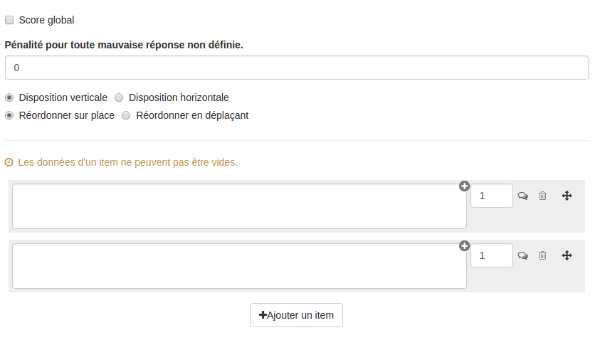

### Question Ordonnancement

---

La question ordonner permet de créer des questions où les utilisateurs devront déplacer des éléments pour les mettre en orde. Ces éléments peuvent être du texte, une image, du son ou une vidéo.

Lorsque vous avez rempli les champs communs à toutes les questions \(cf. [Créer une nouvelle question](create_new_question.md) \), vous devez remplir le formulaire spécifique à la question association.

#### Score global

Par défaut, c'est-à-dire quand cette option n'est pas cochée, le score obtenu sera celui qui est associé au choix que fera l'utilisateur.

Si vous choisissez le score global, des points seront attribués seulement si tout est juste \(points en cas de succès\). S'il y a ne serait-ce qu'une erreur, ce seront les points en cas d'échec qui seront attribués \(ils peuvent être nuls ou négatifs\).

#### Pénalité pour toute mauvaise réponse non définie

Vous pouvez définir dans ce champ une pénalité pour toute erreur effectuée par l'utilisateur lors de la passation. Cette pénalité exprimée en points positifs, par exemple 1 point de pénalité équivaudra a un retrait de 1 point du score total de la question pour chaque réponse erronée. Cela peut donc engendrer des scores négatifs.

Cette pénalité ne se cumule pas à des réponses erronées que le concepteur aurait déjà défini \(association avec un score négatif\).

#### Disposition

Vous pouvez choisir que vos items soient positionnés les uns à côté des autres (disposition horizontale) ou les uns au dessous des autres (disposition verticale).

#### Réordonner sur place / en déplaçant

Vous pouvez choisir parmi deux types d'ordonnancement :

- **réordonner sur place**: Lors de la passation, les items seront disposés les uns au dessous des autres ou les uns à côté des autres. Lors du déplacement d'un item au moment de relâcher ce dernier, celui-ci viendra prendre la place d'un autre. Dans cette configuration, les items ne proviennent pas d'un ensemble à part.
- **réordonner en déplaçant**: Lors de la passation, tous les items sont d'abord dans un ensemble, et ils doivent être déplacés hors de cet ensemble et disposés dans le bon ordre dans un autre ensemble.

#### Les items

Vous devez créer vos items dans l'ordre attendu. Les items peuvent être du texte simple, une image, une vidéo ou encore un audio \(en utilisant l'éditeur de texte riche\).

Chaque item est associé à un score et un feedback. Le score ne peut pas être négatif et sera obtenu par l'utilisateur si l'item est correctement positionné lors de la passation.

Le feedback est un message non obligatoire que vous pouvez adresser à l'utilisateur si celui-ci déplace l'intrus dans un ensemble au moment de la passation. Ce feedback sera affiché en fin d'étape si cette option a été choisie dans les paramètres du questionnaire \(cf. "Afficher les feedbacks en fin d'étape" dans  [Correction](quiz_parameters_correction.md)\) ainsi que dans la correction.  
En cliquant sur l'icône  : , vous ouvrez le champ texte où vous écrirez le feedback.

Si vous souhaitez rajouter de la complexité, vous pouvez ajouter un intrus en cliquant sur "ajouter un intrus"(cette option n'est possible que si vous êtes en mode réordonner en déplaçant). Cet intrus est associé à un score \(nul ou négatif\) et peut aussi avoir un feedback.

Le score sera comptabilisé seulement si l'utilisateur a placé cet intrus dans son ordonnancement.

La poubelle vous permet de supprimer l'intrus.
