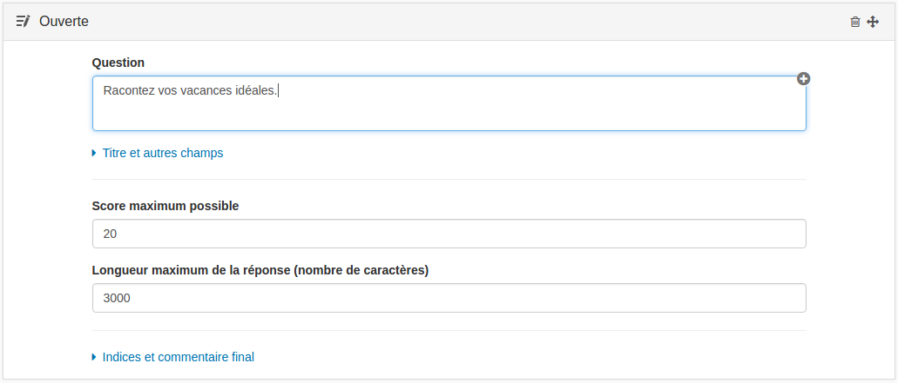

### Question Ouverte

---

La question ouverte permet de créer des questions où les utilisateurs devront répondre par un texte libre pouvant comporter des ressources et être mis en page grâce à l'éditeur de texte riche. La question ouverte nécessite une correction manuelle (cf. [Correction manuelle](manual_correction.md)).

  
Lorsque vous avez rempli les champs communs à toutes les questions \(cf. [Créer une nouvelle question](create_new_question.md) \), vous devez remplir le formulaire spécifique à la question ouverte.

#### Score maximum possible

Dans ce champ vous devez renseigner le score maximum qu'il est possible d'obtenir à cette question. Lors de la correction manuelle, vous noterez la copie sur ce score.

#### Longueur maximum de la réponse

Ce champ obligatoire permet de renseigner la longueur maximale attendue. Cette longueur est à renseigner en nombre de caractères. Lors de la passation l'utilisateur ne pourra pas aller au delà de cette longueur.

