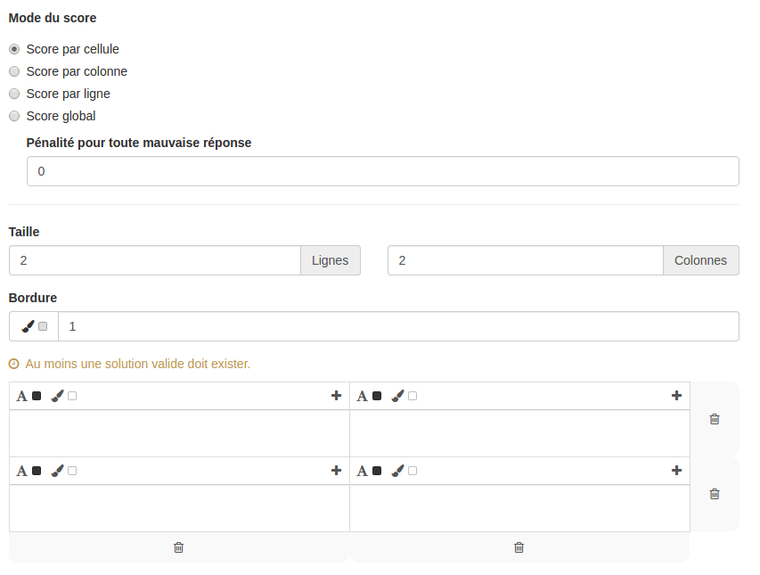

### Question Tableau

---

La question tableau permet de créer des questions où les utilisateurs devra combler des lacunes dans un tableau. Il est possible de les compléter soit en rédigeant une zone texte soit en choisissant l'élément dans une liste prédéfinie.

Lorsque vous avez rempli les champs communs à toutes les questions \(cf. [Créer une nouvelle question](create_new_question.md) \), vous devez remplir le formulaire spécifique à la question tableau.

