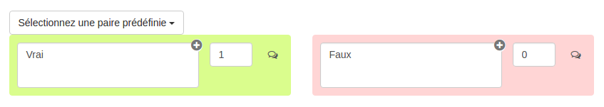

### Question Vrai/Faux

---

La question à vrai/Faux permet de créer des questions où les utilisateurs devront choisir entre deux réponses : vrai/faux, oui/non ou toute autre paire personnalisée créée par le concepteur.

Lorsque vous avez rempli les champs communs à toutes les questions \(cf. [Créer une nouvelle question](create_new_question.md) \), vous devez remplir le formulaire spécifique à la question vrai/faux.

#### Les paires prédéfinies

Pour créer une question vrai/faux ou oui/non le plus rapidement possible, vous pouvez choisir la paire que vous souhaitez dans le menu déroulant "sélectionnez une paire prédéfinie" 

Chaque choix doit être associé à un score et au moins un choix doit avoir un score positif. Le fond de couleur permet de voir si le score associé à la réponse est positif \(vert\) ou négatif ou nul \(rouge\).

Chaque choix peut avoir un feedback. Le feedback est un message non obligatoire que vous pouvez adresser à l'utilisateur si celui-ci sélectionne ce choix. Ce feedback sera affiché en fin d'étape si cette option a été choisie dans les paramètres du questionnaire \(cf. "Afficher les feedbacks en fin d'étape" dans  [Correction](quiz_parameters_correction.md)\) ainsi que dans la correction.  
En cliquant sur l'icône  : , vous ouvrez le champ texte où vous écrirez le feedback.

#### Créer une paire personnalisée

Comme pour la question à choix multiples, les choix peuvent être du texte simple, une image, une vidéo ou encore un audio \(en utilisant l'éditeur de texte riche\). Il vous suffit de placer votre curseur dans la zone de texte et le modifier.

