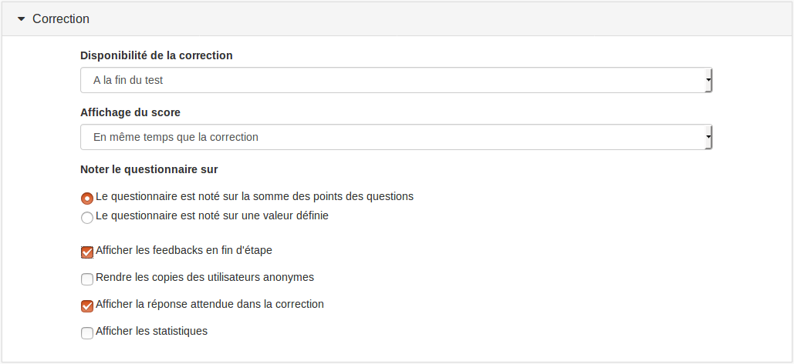

### Correction

---

#### Disponibilité de la correction

Vous pouvez choisir à quel moment vous donnez accès à la correction à l'utilisateur qui fera le questionnaire. Cela peut-être à la fin du test, après le dernier essai de chaque étape ou à partir d'une date précise ou jamais

#### Affichage du score

L'affichage du score peut se faire en même temps que la correction, à la fin du questionnaire ou jamais.

#### Score du questionnaire

Par défaut, le questionnaire est noté sur la somme des points des questions. Cependant, vous pouvez définir une valeur sur laquelle le questionnaire sera noté et la conversion se fera automatiquement.  
Par exemple, vous avez défini 6 questions ayant un score de 1 point chacune et vous souhaitez finalement que ce questionnaire ait un score final sur 20. Vous n'avez pas besoin de changer le score de chaque question, il vous suffit de sélectionner "Le questionnaire est noté sur une valeur définie" et de rentrer le score de 20.

#### Afficher les feedbacks en fin d'étape

Les feedbacks permettent à l'utilisateur de savoir si les réponses qu'il a données lors d'un essai d'une étape sont juste ou faux. En activant cette option, l'utilisateur est guidé vers les réponses attendues mais ces derniêres ne sont pas affichées.  
Exemple de feedback en fin d'étape :  

#### Rendre les résultats des utilisateurs anonyme

Lorsque un questionnaire est joué, il donne lieu à une copie. Ces copies sont visibles dans le menu [résultats](quiz_results.md) en cliquant sur [liste des résultats](quiz_results_list.md). Si cette option n'est pas cochée, tout administrateur du questionnaire peut voir à qui appartient la copie. À contrario, si cette option est cochée, les noms des utilisateurs ne seront pas visibles.

#### Afficher la réponse attendue dans la correction

En cochant cette option, l'utilisateur pourra voir dans la correction la réponse attendue en plus de sa réponse.

#### Afficher les statistiques

En activant cette option, tout utilisateur pourra voir dans la réponse attendue de la correction des statistiques concernant le nombre d'utilisateurs ayant répondu à la question ainsi que le pourcentage des utilisateurs ayant répondu telle ou telle réponse.

