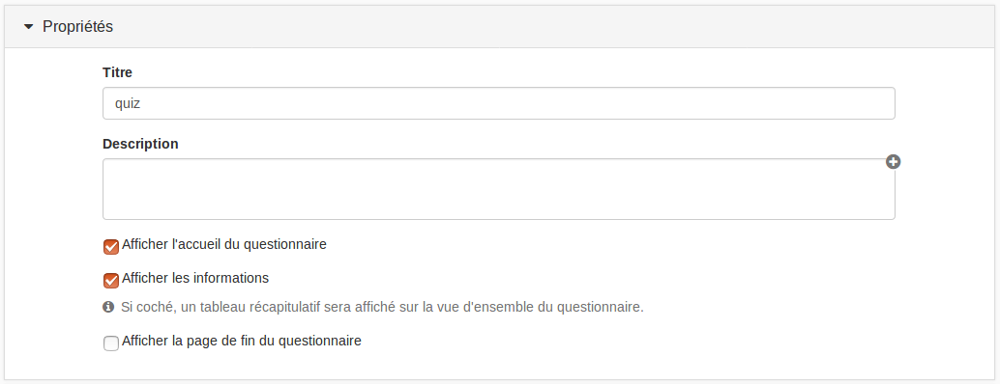

### Propriétés du questionnaire

---

#### Titre

Vous pouvez modifier le titre original de votre questionnaire, mais ce champ ne peut pas rester vide

#### Description

La description de l'exercice que vous ferez dans ce champ sera visible par tous les utilisateurs dans la vue d'ensemble au-dessus du tableau contenant les informations concernant votre questionnaire.

#### Afficher l'accueil du questionnaire

L'accueil du questionnaire est la page avec un tableau contenant les informations de votre questionnaire et le bouton "commencer". Par défaut, cette page s'affiche et l'utilisateur doit cliquer sur "commencer" pour commencer le questionnaire. Si cette option est décochée, l'utilisateur accedera directement à la première étape du questionnaire.

#### Afficher les informations

En cochant cette case, tous les utilisateurs pourront voir le tableau contenant les informations de votre questionnaire dans la vue d'ensemble \(comme ci-dessus\). Si vous ne cochez pas cette case, les utilisateurs ne verront que le bouton "Commencer l'exercice" ainsi que la description s'il y en a une.

#### Afficher la page de fin du questionnaire

En cochant cette case, en fin du questionnaire, tous les utilisateurs auront une page récapitulative avec leur score \(si l'affichage du score est permis\),  le message suivant "Félicitations ! Vous avez terminé le questionnaire." et la possibilité de recommencer l'exercice \(si les paramètres définis par le concepteur le permettent\).

