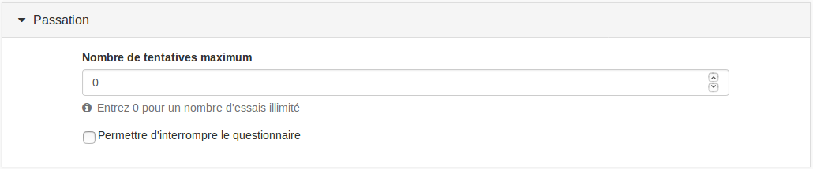

### Passation

---

#### Durée

Vous pouvez définir un temps imparti pour faire le questionnaire. Si vous laissez la durée à 0, il n'y aura pas de limite de temps. Si vous fixez une limite de temps, un compte à rebours s'affichera en haut de chaque étape. Quand ce compte à rebours atteint 0, le questionnaire s'interrompt et est sauvegardé.

#### Nombre de tentatives maximum

Vous pouvez définir ici le nombre de tentatives maximum de l'exercice que l'utilisateur est autorisé à faire. Si vous définissez un nombre de tentatives différent de 0 \(nombre de tentatives illimité\), l'utilisateur est notifié du nombre de tentatives qu'il a au-dessus du bouton "commencer le questionnaire". Une fois le nombre de tentatives maximum atteint, le questionnaire ne pourra plus être joué par l'utilisateur.

#### Permettre d'interrompre le questionnaire

Cette option vous permet de donner la possibilité à l'utilisateur d'interrompre son questionnaire et de revenir dessus ultérieurement pour le terminer. Si vous ne permettez pas d'interrompre le questionnaire et que l'utilisateur quitte le questionnaire sans avoir terminé, sa copie sera tout de même considérée comme terminée.

