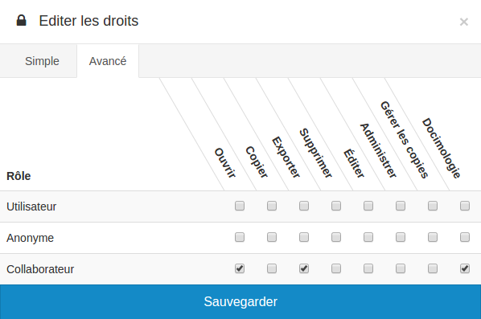

### Droits spécifiques au questionnaire

---

Comme pour toutes les ressources de la plateforme, vous pouvez configurer les droits d'accès au questionnaire \(cf. [Gérer les droits d'accès aux ressources](resources/manage-rights-resources.md)\).

Cependant le questionnaire possède certains droits d'accès qui lui sont spécifiques : **administrer les copies** et **Docimologie**

L'utilisateur ayant le droit **administrer les copies** pourra avoir accès à la [liste des résultats](resources/quiz/result_list.md), l'[export CSV des résultats](resources/quiz/csv_export.md) et la [correction manuelle](resources/quiz/manual_correction.md).

L'utilisateur ayant le droit **Docimologie** pourra avoir accès à la [docimologie](resources/quiz/Docimology.md).

