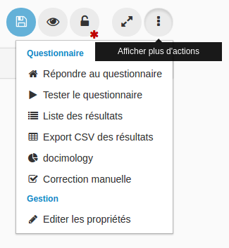

### Tester le questionnaire

---

> Cette fonction n'est accessible qu'aux personnes ayant des droits d'administration sur la ressource.

Dans le menu des actions supplémentaires possibles du questionnaire, vous pouvez accéder à différentes pages en fonction de vos droits :

En tant qu'administrateur du questionnaire, vous avez accès à "tester le questionnaire". Tester le questionnaire vous permet de voir comment sera le questionnaire lors de la passation sans générer de copie. Cela veut dire qu'il n'y aura pas de traces de votre test dans [la liste des résultats](result_list.md), la docimologie ou lors de l'export des résultats au format csv.

