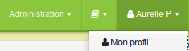
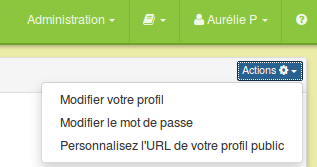
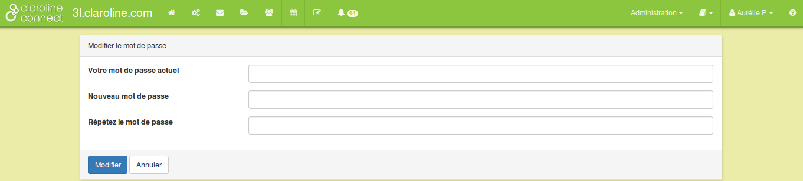

## Modifier votre mot de passe
---

Pour modifier votre mot de passe, cliquez sur "Mon profil"

Figure 76 - Cliquer sur "mon profil" .

Cliquez ensuite sur "Modifier le mot de passe".

Figure 77 - Modifier le mot de passe.

Indiquez votre mot de passe actuel, tapez deux fois votre nouveau mot de passe et cliquez sur "Modifier"

Figure 78 - Insérer votre nouveau mot de passe.

